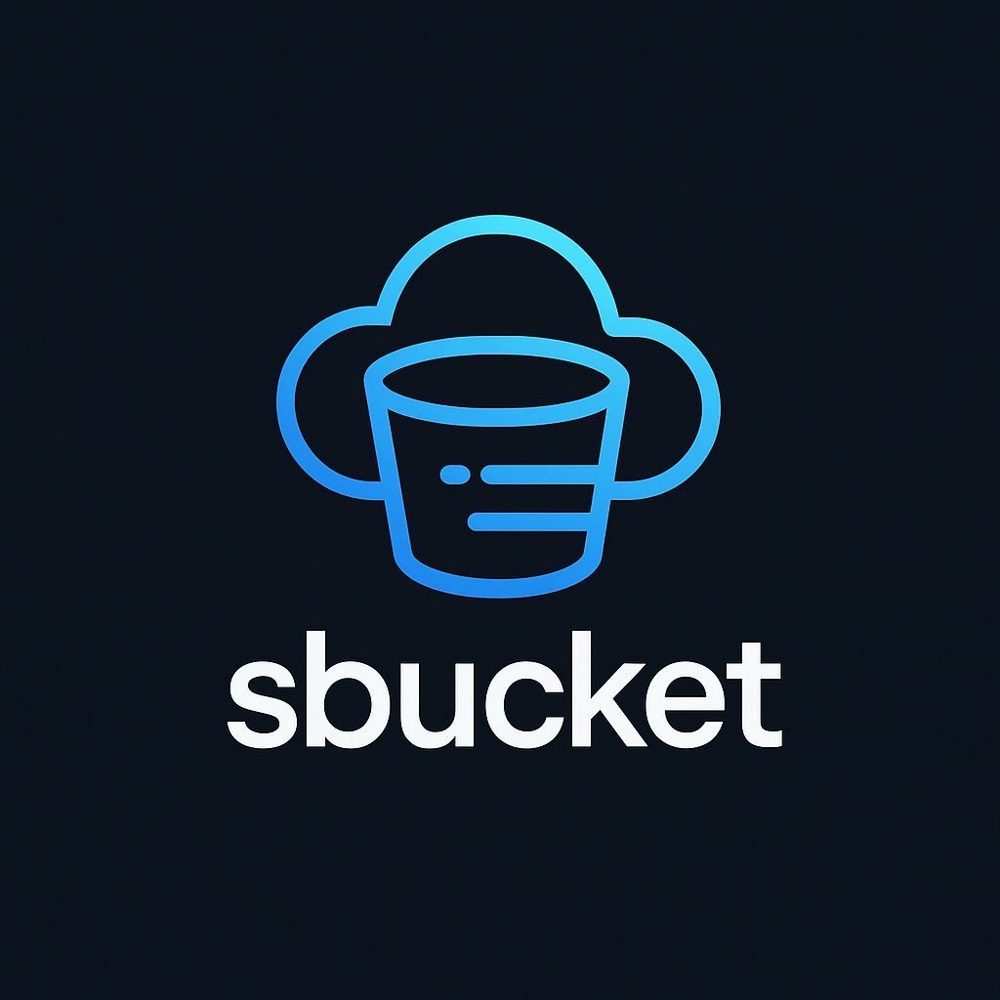

# 🌩️ SBucket - S3-Like Object Storage (Go + MinIO)



SBucket is a minimal, self-hosted object storage backend similar to Amazon S3, built using **Go**, **Fiber**, and **MinIO**. It supports user-authenticated file upload, download, listing, and signed URL access.

---

## 🚀 Features

- 🔐 User Authentication (JWT-based)
- 📁 Create Buckets (per user)
- 📤 File Uploads via API or Presigned URLs
- 📥 Secure File Downloads
- 📜 File Listing (per bucket)
- 🔗 Signed Upload/Download URLs
- 🐳 MinIO Integration (S3-compatible local storage)
- 🛡️ Secure, Fast, and Clean Architecture

---

## 📦 Technologies Used

- Go (Golang)
- Fiber Web Framework
- MinIO (S3-compatible object store)
- GORM (PostgreSQL or SQLite)
- JWT Authentication
- Docker (optional)

---

## 🏗️ Project Structure

```
sbucket/
├── main.go
├── go.mod
├── internal/
│   ├── api/
│   │   └── handler/
│   ├── db/
│   ├── model/
│   └── storage/
└── uploads/ (local or MinIO backend)
```

---

## ⚙️ Setup Instructions

### 1. Install Go

[Download and install Go](https://go.dev/dl/) for your platform.

### 2. Clone the Repo

```bash
git clone https://github.com/code-cults/sbucket.git
cd sbucket
```

### 3. Start MinIO (Docker)

```bash
docker run -p 9000:9000 -p 9001:9001 \
  -e "MINIO_ROOT_USER=admin" \
  -e "MINIO_ROOT_PASSWORD=admin123" \
  -v /data:/data \
  minio/minio server /data --console-address ":9001"
```

Access MinIO Console at: [http://localhost:9001](http://localhost:9001)

Create a bucket: `sbucket`

### 4. Run the Server

```bash
go run main.go
```

Server will run at `http://localhost:3000`.

---

## 🔐 Auth Flow

- `/api/auth/signup` - Create account
- `/api/auth/login` - Get JWT token
- Add `Authorization: Bearer <token>` to all protected requests

---

## 📂 API Endpoints

| Method | Endpoint                                         | Description               |
|--------|--------------------------------------------------|---------------------------|
| POST   | `/bucket`                                        | Create bucket             |
| POST   | `/bucket/:id/upload`                             | Upload file               |
| GET    | `/bucket/:id/files`                              | List files in bucket      |
| GET    | `/bucket/:id/file/:filename`                     | Download file             |
| GET    | `/bucket/:id/file/:filename/signed`              | Get signed download URL   |
| GET    | `/bucket/:id/upload-url/:filename`               | Get signed upload URL     |

---

## 📋 To-Do (Optional Features)

- 🔁 File versioning
- 📊 Storage quota per user
- 🌐 Frontend React UI (planned)
- 🧪 Unit & integration tests

---

## 📜 License

MIT License

---

## 🤝 Contributing

PRs welcome! File issues or ideas to improve.

---

## ✨ Author

Made with ⚡ and ❤️ by [code.cults]

